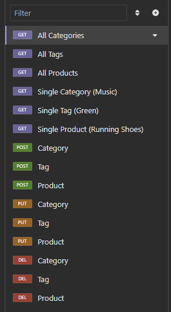
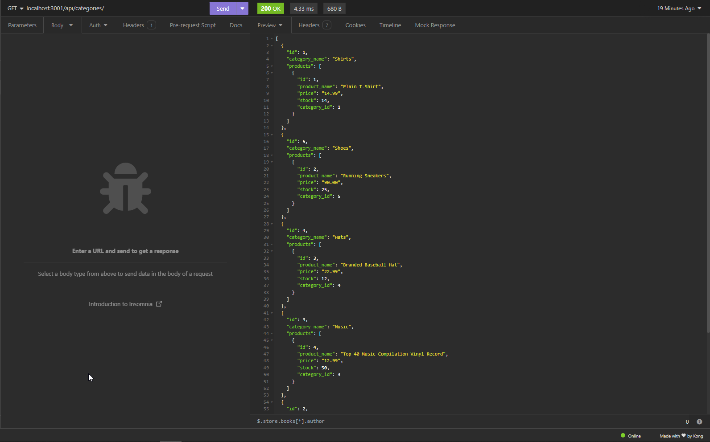

# E-commerce Back End

## Goal: Create the back end to an e-commerce site
This repository should show that I can properly fill in the required routes and server functionality for an e-commerce site using postgres and insomnia.

## Acceptance Criteria
- GIVEN a functional Express.js API
- WHEN I add my database name, PostgreSQL username, and PostgreSQL password to an environment variable file
- THEN I am able to connect to a database using Sequelize
- WHEN I enter schema and seed commands
- THEN a development database is created and is seeded with test data
- WHEN I enter the command to invoke the application
- THEN my server is started and the Sequelize models are synced to the PostgreSQL database
- WHEN I open API GET routes in Insomnia Core for categories, products, or tags
- THEN the data for each of these routes is displayed in a formatted JSON
- WHEN I test API POST, PUT, and DELETE routes in Insomnia Core
- THEN I am able to successfully create, update, and delete data in my database

## Screenshots

## Video Link
[Usage Video Link](https://drive.google.com/file/d/1oKMgxRMDH0YUJQDp2yQlOJT9vIqG4kWk/view?usp=sharing)
